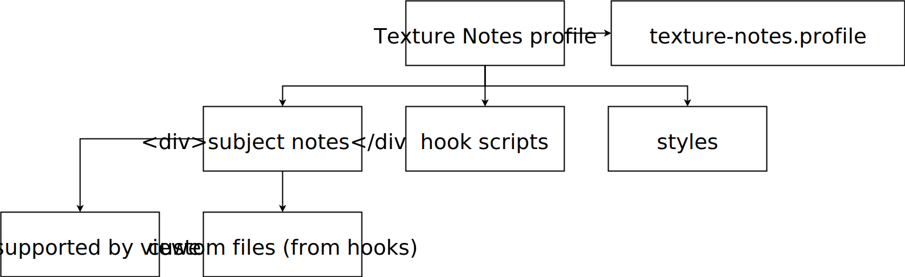

= Texture Notes 

A lecture notes manager that aims for self-studying and university classes footnote:[Mainly, the author of this program, https://github.com/foo-dogsquared[@foo-dogsquared].]. 
It is mainly composed of a command line program where you can easily manage your LaTeX notes. 

For now, the notes manager is specifically created for my specific workflow so no there's not much room for general use-cases. 

My LaTeX workflow and the program is inspired from https://castel.dev/[Gilles Castel's posts]. 
Big thanks to him and for sharing his knowledge! 

Also since this is my first project made with https://www.rust-lang.org/[Rust], you'll have to excuse my bad codebase for a little bit. 
Nonetheless, pull requests for improvements are always welcome! 

== Objectives 

While creating this program, I have certain objectives to attain. 
Setting up and openly stating the objectives can make you learn the strengths and limitations of the program. 

* Create a personal knowledge base (made with LaTeX documents) that is easily searchable and retrievable. 

* Automate LaTeX files management including adding, deleting, and compiling documents. 

* Make the program fit nicely with the existing workflow. 
(I doubt this will happen though, TBH.) 

Furthermore, this program is specifically created for my workflow which leaves little room for other use cases. 
I hope implementing some features that mitigates against that (but not fully). 

== Limitations

Now the objectives are out, let's explicitly lay out the expected limitations of this program. 

* First and foremost, it's a niche tool for a niche use. 

* Linking between concepts similar to a mind map is not possible. 
For me, it's suitable to think more of a https://en.wikipedia.org/wiki/Tree_%28data_structure%29[tree] rather than a https://en.wikipedia.org/wiki/Graph_(data_structure)[graph]. 

* Limited importing options for LaTeX documents. 
Due to trying to be two things at once, there is a compromise with how you can freely import other LaTeX documents. 

* There's not much room for customizability. 
It is based from my specific workflow, after all. 
It is ought to happen. 
Maybe in the future, I'll improve to be used in general cases but I doubt it will improve the program. 

* It uses LaTeX. ;) 
footnote:[I would like to create a generalistic personal knowledge base for Asciidoctor documents or even better, a configurable personal knowledge base similar to https://gohugo.io/content-management/archetypes/[Hugo archetypes] and https://gohugo.io/content-management/formats/#additional-formats-through-external-helpers[the external helpers system].] 

If you're looking for an alternative for your personal knowledge base, a simple directory tree of notes will do. 
I've also made my personal knowledge base with just a folder of https://asciidoctor.org/[Asciidoctor] documents and created a Python script for compiling them all. 
I've https://github.com/foo-dogsquared/personal-notes/[open sourced] it just for backup purposes. 
You can then search for your files with the `find` command. 

== Usage 

For now (or maybe not), this program is specifically made for my LaTeX workflow. 

In order to make use of this application, you need to have the following programs installed already in the system: 

* A LaTeX distribution (http://www.tug.org/interest.html#free[here's a list of options, if you haven't installed one])
* https://www.ctan.org/pkg/latexmk/[Latexmk]

=== Quick start 

To prevent getting a mess, Texture Notes needs a profile which is located in a folder named `texture-notes-profile`. 

You can simply create a profile with the `init` command. 

[source, shell]
----
# Initialize the profile in the current directory 
texture-notes-v2 init

# Initialize the profile in the other directory 
texture-notes-v2 init --target "~/Documents"
----

Once you have initialized a profile, you can now create subjects and notes. 
Though in order to add notes, you need to create subjects/folders. 

[source, shell]
----
# Add some subjects 
texture-notes-v2 add subjects "Mathematics" "Science"

# After adding some subjects, you can add some notes 
texture-notes-v2 add notes "Mathematics" "Introduction to Calculus" 

# You can then write/fill up the note
# To quickly open a note, just run the following command 
texture-notes-v2 open notes "Mathematics" "Introduction to Calculus"

# You can also refer to the note ID instead for convenience 
# Assuming the note has an ID of 1
texture-notes-v2 open notes-id 1 

# To compile all notes under "Mathematics" 
texture-notes-v2 compile subjects "Mathematics"
----

== Architecture 

Texture Notes v2 uses Rust for building the core and command line interface. 
It also use https://sqlite.org/index.html[SQLite] for the database. 

A Texture Notes profile is composed of the profile input, notes, templates, and common files for customizable options. 
The note manager also enforces a specific folder structure with the data. 

== Features 

Here are the features to be implemented whenever possible. 

* Hooks scripts using Rust. 
* Exclude the new note in the database. 

I would also like to improve the program on the following areas: 

* Data design which is quite messy as of v2.0.0. 
There has to be a better way for it without entirely relying with a database. 
* Performance to be improved after the core features has been implemented. 
For now, it's not a priority. 
* Cross-platform compatibility. 
As a user of multiple OS (i.e., Windows and Linux), I really like to make this possible to easily use this program. 

